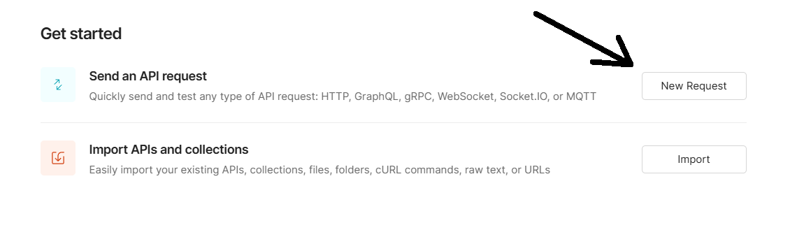
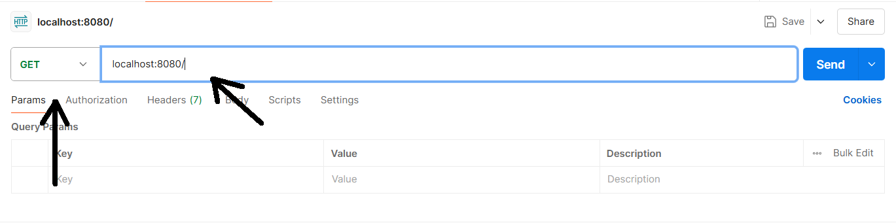
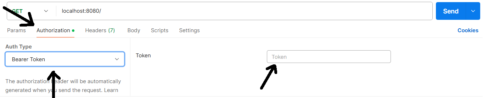
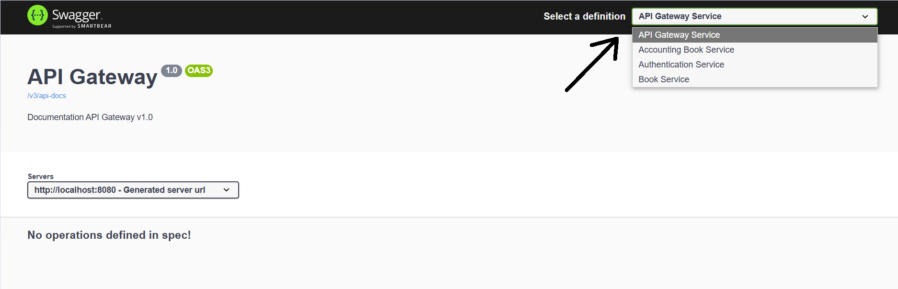
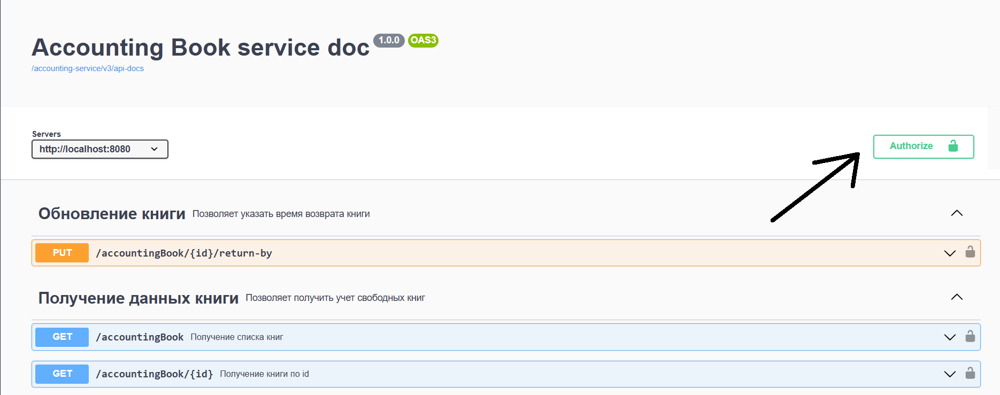
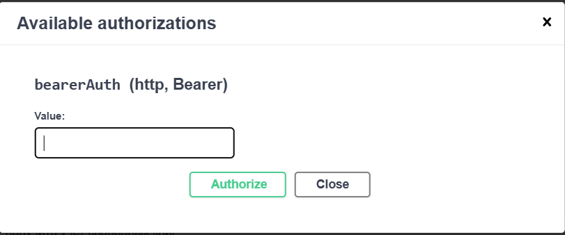

# Тестовое задание Library API Microservices

Разработка микросервисного проекта цифровой библиотеки

## Основные модули

1. api-gateway единая точка входа для микросервисов
2. book-service для хранения, добавления, удаления, редактирования книг
3. accounting-service для учета свободных книг
4. auth-service для аутентификации и авторизации пользователей

## Запуск программы

1. клонирование репозитория `git clone https://github.com/uluanaparf/testing_task_microservices.git
2. Создание 2-ух баз данных для книг и пользователей  
2. добавление конфигурации базы данных в book-service, accounting-service, auth-service
3. настройка файла `application.properties` для каждого микросервиса, которые находятся в resources
```properties
# ===============================
# DATABASE
# ===============================

spring.datasource.url = jdbc:mysql://localhost:3306/db_name
spring.datasource.username=your_username
spring.datasource.password=yourpassword

# ===============================
# JPA / HIBERNATE
# ===============================

spring.jpa.hibernate.ddl-auto=update
spring.jpa.show-sql=true

```
4. Запустите проект в порядке eureka-server -> book-service -> auth-service -> accounting-service -> api-gatewey
## Используемые технологии

1. Spring, Boot, MVC
2. ORM: Hibernate, Spring Data, Jpa
3. RDBMS: MySQL
4. DTO
5. Swagger
6. Authentication via Bearer Token
7. Microservices architecture 
8. Spring Cloud
___

### Проверка работы

Для проверки работы микросервисов лучше всего использовать Postman(https://www.postman.com/) или Swagger-ui

#### Postman
1. Перейдите на сайт https://www.postman.com 
2. Нажмите кнопку New Request для отправки запроса 
3. Выберите тип запроса и введите в строку запроса localhost:8080/адрес_эндпоинта  Для отправки запроса на микроссервисы book-service и accounting-service, сначала необходимо зарегистрироваться в auth-service и получить токен
4. Для использования токена перейдите на вкладку Authorization и выберите Auth Type: Bearer Token, в поле Token вставьте полученный токен 
5. Теперь у вас есть доступ ко всем эндпоинтам, пока токен действителен (30 минут)
___
#### Swagger-ui
1. Перейдите по адресу http://localhost:8080/swagger-ui.html
2. Выберите нужный вам микросервис (для микросервисов book-service и accounting-service необходимо сначала зарегистрироваться и получить токен)
3. Раскройте нужную вкладку и нажмите Try it out 
4. Вставьте тело запроса(если это необходимо) и отправьте запрос нажатием кнопки Execute
5. Для использования токена нажмите кнопку Authorize 
6. Вставьте токен в поле Value и нажмите кнопку Authorize 
7. Теперь у вас есть доступ ко всем эндпоинтам, пока не закончится срок действия токена (30 минут)

### Получение токена
Для получения доступа необходимо зарегестрироваться с помощью эндпоинта /auth/register.

В тело запроса введите имя, пароль и email в необходимом формате:
```
{
    "name": "User1",
    "password": "Userpassword",
    "email": "user1@gmail.com"
}
```
Затем с помощью эндпоинта /auth/login получите токен введя в тело запроса свои данные:
```
{
    "username": "User1",
    "password": "Userpassword"
}
```
___
## Эндпоинты
### book-service
- GET /books - получение списка всех книг в базе данных
- GET /books/{id} - получение книги по id 
- GET /books/isbn/{isbn} - получение книги по isbn
- POST /books - добавление книги (синхронное добавление книги в микросервис accounting-service)
- PUT /books/{id} - редактирование книги по id 
- DELETE /books/{id} - удаление книги по id 
  <br>

### accounting-service
- GET /accountingBook - получение списка книг, которые взяли в пользование
- GET /accountingBook/borrowed - получение списка книг, которые еще не вернули
- GET /accountingBook/returned - получение списка книг которые вернули
- GET /accountingBook/{id} - получение книги по id
- PUT /accountingBook/{id}/return-by - редактирование книги для указания время возврата
- POST /accountingBook - добавление книги
  <br>

### auth-service
- POST /auth/requests - добавление пользователя для регистрации
- POST /auth/login - добавление пользователя для логинации и получения токена
- GET  /auth/validate - проверка токена на активность 
  <br>
